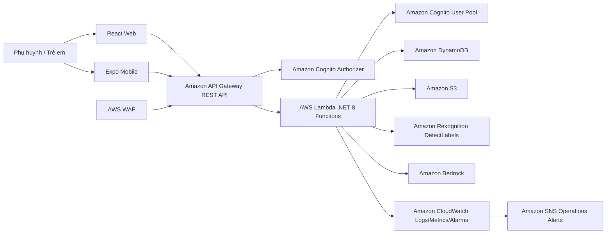

# GreenLens AWS Architecture

Tài liệu này mô tả kiến trúc AWS dựa trên luồng hiện có của GreenLens Kids:

- Frontend web React/Vite và mobile Expo/React Native.
- Backend .NET 8 triển khai theo AWS Lambda function qua `backend/serverless.yml`.
- Xác thực bằng Amazon Cognito, API qua Amazon API Gateway, dữ liệu trong Amazon DynamoDB.
- AI Camera dùng Amazon Rekognition, Amazon S3 và Amazon Bedrock.
- Vận hành dùng AWS WAF, Amazon CloudWatch và Amazon SNS.

File sơ đồ có icon AWS: `docs/architecture/greenlens-aws-architecture.drawio`.

## Luồng Tổng Quan

## Các Luồng Chính

1. Splash, đăng nhập, đăng ký và tạo nhân vật:
   - App mở splash, sau đó vào `login`, `register` hoặc avatar setup.
   - `/auth/register`, `/auth/login`, `/auth/refresh` gọi Lambda Auth.
   - Auth Lambda gọi Cognito User Pool để tạo user, đăng nhập, refresh token.
   - `/child-profiles` tạo hồ sơ trẻ, liên kết `childId` với `cognitoSub`, lưu vào `GreenLens-ChildProfiles`.

2. Dashboard, profile, streak và phần thưởng:
   - App dùng Bearer JWT trong các request đã bảo vệ.
   - API Gateway dùng Cognito authorizer; backend tiếp tục đọc `cognitoSub` từ token.
   - `/child-profiles/{childId}`, leaderboard, streak và check-in đọc/ghi `GreenLens-ChildProfiles`.

3. AI Camera:
   - Frontend gửi multipart image và `childId` tới `/ai-camera/analyze`.
   - AWS WAF rate-limit endpoint này theo IP; Lambda kiểm tra quota trong `GreenLens-AiUsage`.
   - Lambda gọi Rekognition `DetectLabels`, validate ảnh có phải rác hay không.
   - Ảnh hợp lệ được lưu vào S3 prefix `uploads/yyyy/MM/dd/` với lifecycle xóa sau 1 ngày.
   - Lambda gọi Bedrock để sinh hướng dẫn phân loại/tái sử dụng/tác động môi trường; có fallback nội bộ khi Bedrock lỗi.
   - XP/progress cập nhật vào `GreenLens-ChildProfiles`.

4. Quiz:
   - `/quiz/generate` đọc context trẻ từ `GreenLens-ChildProfiles`, ưu tiên lấy quiz sẵn từ `GreenLens-QuizPool`.
   - Nếu pool thiếu, Lambda enqueue/invoke `quizPoolRefill`.
   - `quizPoolRefill` gọi Bedrock để tạo câu hỏi và lưu vào `GreenLens-QuizPool`.
   - Session quiz lưu ở `GreenLens-QuizSessions`; fallback câu hỏi ở `GreenLens-QuizFallbacks`.
   - `/quiz/complete` chấm điểm và cộng XP/progress.

5. Mini game:
   - `/mini-games/trash-sort/items` đọc cấu hình item/bin từ `GreenLens-MiniGameItems`.
   - Icon mini game có thể phục vụ từ S3 bucket asset qua `MINI_GAME_ASSET_BASE_URL`.
   - `/mini-games/trash-sort/results` lưu kết quả vào `GreenLens-MiniGameResults` và cập nhật XP/badge trong profile.

6. Quan sát và cảnh báo:
   - API Gateway và Lambda gửi log/metric vào CloudWatch.
   - CloudWatch Dashboard theo dõi Lambda errors, duration, invocations và WAF blocked requests.
   - CloudWatch Alarms gửi cảnh báo tới SNS topic `GreenLens-OperationsAlerts-{stage}`.

## AWS Service Map

| Thành phần app | AWS service/icon |
| --- | --- |
| API public | Amazon API Gateway |
| Chặn request xấu/rate limit | AWS WAF |
| Compute backend | AWS Lambda |
| Auth/JWT/user pool | Amazon Cognito |
| Hồ sơ, streak, quiz, mini game, quota | Amazon DynamoDB |
| Ảnh AI Camera và asset mini game | Amazon S3 |
| Nhận diện nhãn ảnh | Amazon Rekognition |
| Sinh hướng dẫn và câu hỏi quiz | Amazon Bedrock |
| Quyền gọi service | AWS IAM |
| Log, dashboard, alarm | Amazon CloudWatch |
| Email/ops alert | Amazon SNS |

## Ghi Chú Triển Khai

- Region mặc định trong `serverless.yml`: `ap-southeast-1`.
- Local Docker dùng in-memory storage trong một số flow; kiến trúc AWS dùng Cognito và DynamoDB thật.
- Frontend hosting trên AWS chưa được cấu hình trong repo. Sơ đồ để React Web/Expo Mobile là client bên ngoài AWS gọi API Gateway; nếu triển khai web lên AWS, có thể bổ sung CloudFront + S3 hoặc Amplify Hosting.
- API Gateway REST API hiện cấu hình binary media type `multipart/form-data` cho AI Camera.
- `GreenLens-AiUsage`, `GreenLens-QuizSessions` và `GreenLens-QuizPool` là dữ liệu có TTL/transient theo cấu hình hiện tại.
